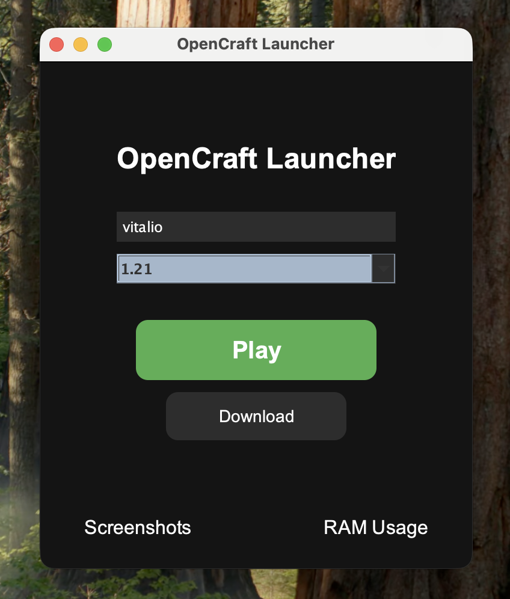

# OpenCraft - Minecraft Downloader and Launcher

Open source launcher for Minecraft

## How to play
1. Install [Java 25](https://www.oracle.com/ua/java/technologies/downloads)
2. Download launcher
3. Now you can choose the Minecraft version and play!

## Features
- [x] Running preselected Minecraft versions
- [ ] Support for Fabric mods
- [ ] Custom skins

## Build from source

- Java 11 or higher
- Maven 3.6 or higher

## Build from source

### Build for Mac/unix
Use `-fat.jar` for starting launcher
```bash
mvn clean package
```

### Build for Windows
```bash
mvn clean package -Pwindows-exe
```

## How launcher works

- Launcher will create a `minecraft`(or `.minecraft`) directory in default path.
- Launcher will use these files to start Minecraft with the proper classpath and JVM arguments
